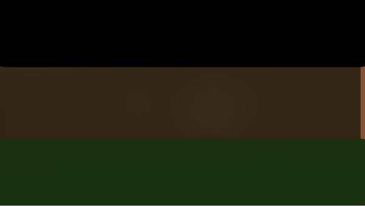

# Lab 4

[Github Repo](https://github.com/dturk0610/EE465)

## My Approach

Oh boy, if you aren't already, you might want to sit down for this. This entire discussion of this lab will be broken up into a few sections. One of the first sections has to deal with the [3D Engine](engine.md) that I am creating. The next key feature/component that will be discussed is the underlying math and [classes](objAndClass.md) (programming objects) that were used/implemented. Finally the approach to this lab itself. The first two approaches can be found in their respective locations (linked any time either are mentioned) while this lab's approach will be detailed in full below.

## [3D Engine](engine.md) approach

The [3D Engine](engine.md) that I wanted to implement is constantly being adapted as I am adding in new features. The idea behind this [engine](engine.md) is that I wanted to have something that was very adaptable. Adaptable to the point that it would be easy enough to implement feautures such as a drag and drop of obj files or something similar. At the very least I wanted to make it so that a developer (as of right now me specifically) would be able to add new objects into the scene with as minmal lines of code as possible. More about the [engine](engine.md) specifically can be found [here](engine.md). This information will hopefully update more as I update the project and my future labs as a whole. The separation of this approach from the lab's approach will allow me to update these approach files separately so that I can reuse them in the other labs/projects that use the same [3D engine](engine.md).

## [Math/class objects](objAndClass.md) approach

What is meant by this approach is simply that new objects and classes were implemented into all of this code. This was namely done for easy of access to variables and to reduce weird issues that I was having with the [MV](../Common/MV.js) objects from the [MV](../Common/MV.js) code in the [Common](../Common/) folder. Another reasoning to this was due to my interest in implementing a very useful class called quaternions. More about this class will be dicussed in full here, as well as all of the other useful classes and objects that I used to fully implement this engine. This information will hopefully update more as I update the project and my future labs as a whole. The separation of this approach from the lab's approach will allow me to update these approach files separately so that I can reuse them in the other labs/projects that use the same 3D engine.

## Lab specific approach

For me, this lab served as a way to get modular lighting situations and object rendering working as I prepare and develop for the final game project for the end of the semester. Knowing that I needed to create an interactive 3D scene for that final project, I wanted to make this scene as interactive and adaptable as possible too. Because of this, the aforementioned approaches are fitting to have came first for this lab. As for the intention of this class, the intention was to learn how to setup different lighting methods, get both perspecitve and orthographic projections working as well as serve as an introduction to the 3D environment. A chair object was provided as the object to have rendered. However, given the aforementioned engine, this interpretation of the lab will have a couple other viewable objects.

The first step that I had to take was to get viewing successfully working on the scene. To do this I first set up a series of differently colored quad objects and got them to be viewed in the scene:

The next thing I wanted to get working was a brief amount of movement (all controls detailed below):

Next was rotations to allow for the user to turn around and observe their environment (all controls detailed below):

After these were both working it was onto directional and point light sources (non specular):

Keeping in mind that the above lights do not use specular reflections, the next thing was to integrate a specular lighting toggle where the user could toggle between the two (all controls detailed below):

Finally after getting all view related things working, I imported the given chair object and added it to the scene to view it:

At this point all of what needed to be implemented had been. The last thing that I wanted to get implemented and working was the toggle for changing the projection matrix from perspective to othorgraphic and back. After adding that in we get (all controls detailed below):

The final thing that I wanted to add in, was the "look at" functions. Oh boy, was this a doozy. Since I am using quaternions and I wanted to keep my code true to this, figuring out how to get the look at function to work was, to say the least, a process. However, after much pain and frustration, I got it to work (all controls detailed below):

This all was a very frustrating process as I was attempting to implement this all. A lot of debugging and bug fixing happened as I was comparing this project to attributes from the [Unity Game engine](https://unity.com). I am very familiar with that environment and was using Unity's camera to figure out what was wrong with my matricies that described where the camera was. However, after a long time of trial an error, eventually I got something that looked pretty good so far. The only control that is, questionable in how it makes the app look visually is the look at functionality. There is a weird snapping effect that can happen that feels a bit jarring that will make me need to revisit this feature in the future. However, until then enjoy Z-targetting at its finest.

## Controls

### Movement

- W: move forward based on where the player/user is looking
